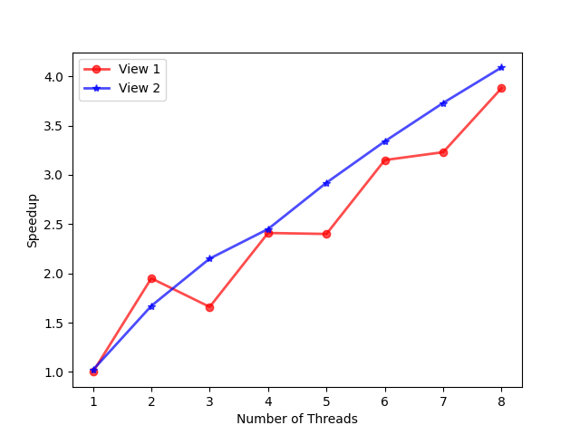
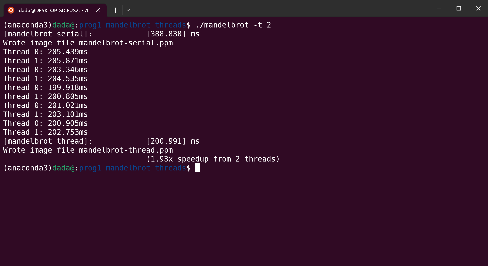
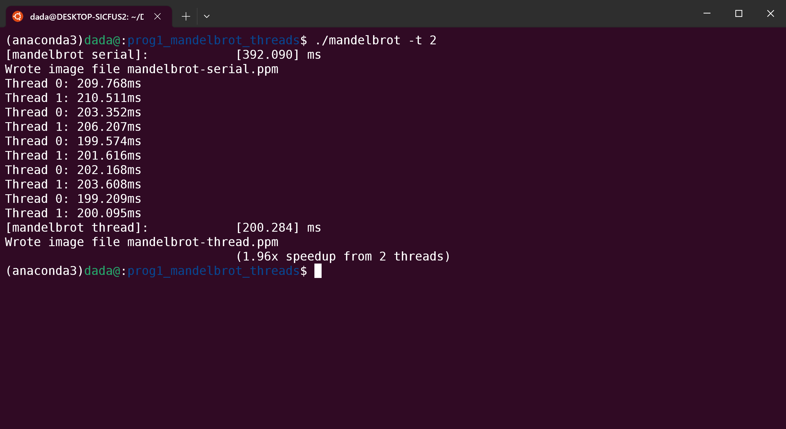
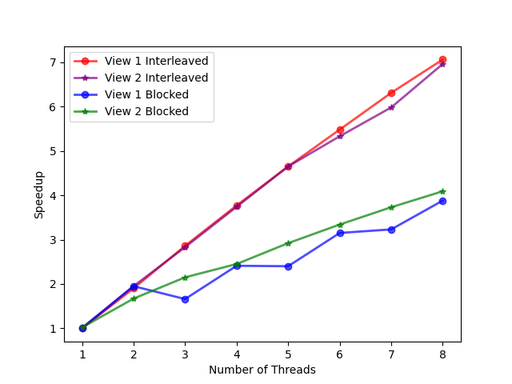

# 实验环境
- Ubuntu 20.04
- Intel Core i7 10750H处理器（6核心12线程）
- Intel ispc v1.18.0


# Program 1-Mandelbrot Thread
&emsp;&emsp;本实验要求基于多线程实现Mandelbrot图片生成。根据线程总数`numThreads`，将原图片进行分割并分配给不同线程进行操作，通过多线程在多核上运行来减少程序运行的时间，获得加速比。

&emsp;&emsp;代码如下：
```c
void workerThreadStart(WorkerArgs * const args) {
    float x0 = args->x0, y0 = args->y0;
    float x1 = args->x1, y1 = args->y1;
    int tid = args->threadId;
    int tot = args->numThreads;
    int height = args->height;
    int width = args->width;
    int maxIterations = args->maxIterations;

    int numRows = height / tot;
    int tmp = numRows;
    if (tid == tot - 1) numRows += (height % tot);

    int startRow = tid * tmp;

    mandelbrotSerial(x0, y0, x1, y1, width, height, startRow,
                        numRows, maxIterations, args->output);
}
```

&emsp;&emsp;得到的加速比折线图如下：



## Subproblem 1 - Is Speedup Linear in the Number of Threads Used?
&emsp;&emsp;View 1加速比和线程数量近似线性；View 2几乎完全成线性关系。

&emsp;&emsp;由于6核处理器支持12个线程，每多一个线程，处理器的利用率都会增加，同时并行的线程各自的工作量都会减少，从而能获得更多加速。

&emsp;&emsp;然而我们不能忽视一个现象：View 1的样例中，当线程数为3时获得的加速比反而比线程数为2时还要少，这是因为**计算量的分配不平均**导致的。

## Subproblem 2 - Confirm the Hypothesis
&emsp;&emsp;用`CycleTimer::currentSeconds()`可以计算每个线程的运行时间，打印每个线程的运行时间，由于计算运行时间的逻辑是取5次运行中耗时最小的那次，所以打印的线程情况会循环5次。

```cpp
void workerThreadStart(WorkerArgs * const args) {

    // TODO FOR CS149 STUDENTS: Implement the body of the worker
    // thread here. Each thread should make a call to mandelbrotSerial()
    // to compute a part of the output image.  For example, in a
    // program that uses two threads, thread 0 could compute the top
    // half of the image and thread 1 could compute the bottom half.

    double startTime = CycleTimer::currentSeconds();

    /* computation process */

    double endTime = CycleTimer::currentSeconds();
    printf("Thread %d: %.3fms\n", args->threadId, (endTime - startTime) * 1000);
}
```

&emsp;&emsp;线程数为2时，运行结果如下：



&emsp;&emsp;然而线程数为3时，运行结果如下：



&emsp;&emsp; 可以发现2个线程时，每个线程的运行时间是均匀的，但是3个线程时，1号线程运行时间远高于0号线程和2号线程。这是因为虽然每个线程都平均分配了若干行，但是计算量却不一样。View 1图像的特点是每个像素的亮度都和计算该像素的复杂度正相关，图像的中间远比上下两侧更亮，1号线程刚好被分配到了计算该图像的中间区域，所以计算耗时远远大于另外两个线程，也就拖慢了整体的线程运行时间。View 2样例图片整体都很暗，不会出现计算量分配不均匀的情况。总结：**使用多线程并行计算时，应该尽量使每个线程的计算量均匀**。

## Subproblem 3 - Performance Improvement
&emsp;&emsp;这里我改进了以下对各个线程的任务分配，由原来的`blocked`方式改为了`interleaved`方式，加速比相比于原来取得了很多提升，线程数为8时view 1和view 2的加速比都达到了7x左右。这是因为：

- `interleaved`方式下，线程并行执行时能有更好的空间局部性。
- `interleaved`方式下，线程计算量的分配更加平均。通过下面两张图的对比就能发现这一点。


```c
void workerThreadStart(WorkerArgs * const args) {
    /* interleaved version */

    float x0 = args->x0, y0 = args->y0;
    float x1 = args->x1, y1 = args->y1;
    int tid = args->threadId;
    int tot = args->numThreads;
    int height = args->height;
    int width = args->width;
    int maxIterations = args->maxIterations;

    for (int i = 0; i + tid < height; i += tot)
    {
        mandelbrotSerial(x0, y0, x1, y1, width, height, i + tid, 
                        1, maxIterations, args->output);
    }
}
```



&emsp;&emsp;可以看到相比于`blocked`的计算分配方式，`interleaved`方式获得了更多的加速比，且由于任务量分配合理，加速比和线程数呈现出很明显的线性增长关系。

## Subproblem 4 - 16 Threads VS. 8 Threads
&emsp;&emsp;设置线程数为16时输出如下：

```shell
$ ./mandelbrot -t 16
[mandelbrot serial]:            [390.369] ms
Wrote image file mandelbrot-serial.ppm
[mandelbrot thread]:            [53.693] ms
Wrote image file mandelbrot-thread.ppm
                                (7.27x speedup from 16 threads)

$ ./mandelbrot -t 8
[mandelbrot serial]:            [392.977] ms
Wrote image file mandelbrot-serial.ppm
[mandelbrot thread]:            [54.832] ms
Wrote image file mandelbrot-thread.ppm
                                (7.17x speedup from 8 threads)
```

&emsp;&emsp;可以发现相比于8线程，16线程的性能几乎没有提升。

&emsp;&emsp;因为6核处理器最多支持12个线程互不干扰地并行执行。16线程虽然使得各个线程的工作量进一步减小，但同时为处理器带来了额外的线程调度的开销，几乎无法带来任何性能提升。

&emsp;&emsp;同时由此可知，线程数设置为12时能够获得最多的加速比。
```shell
./mandelbrot -t 12
[mandelbrot serial]:            [406.685] ms
Wrote image file mandelbrot-serial.ppm
[mandelbrot thread]:            [39.195] ms
Wrote image file mandelbrot-thread.ppm
                                (10.38x speedup from 12 threads)

$ ./mandelbrot -t 8
[mandelbrot serial]:            [392.977] ms
Wrote image file mandelbrot-serial.ppm
[mandelbrot thread]:            [54.832] ms
Wrote image file mandelbrot-thread.ppm
                                (7.17x speedup from 8 threads)
```


# Program 2 - Vecintrin
## Subproblem 1 - Vectorizing ClampExp
&emsp;&emsp;本实验要求基于Stanford CS-149提供的**伪内置向量指令(fake vector intrinsic)**来实现一个基于SIMD向量运算指令的浮点数数组幂运算。阅读`CS149intrin.h`头文件中的函数定义和注释，以及`main.cpp`中的`absVector()`向量例程，可以比较容易上手该实验提供的伪向量指令。

&emsp;&emsp;`clampedExpVector()`的AC代码如下，注意每一步操作中掩码的使用。同时注意由于数组长度`N`不一定整除向量长度`VECTOR_WIDTH`，最后一步循环时的`maskAll`不一定全1，如果无脑设置全1可能会造成数组越界访问。

```c
void clampedExpVector(float* values, int* exponents, float* output, int N) {
  __cs149_vec_float x, _x, result;
  __cs149_vec_float nines = _cs149_vset_float(9.999999f);
  __cs149_vec_int exp;
  __cs149_vec_int zeros = _cs149_vset_int(0), ones = _cs149_vset_int(1);
  __cs149_mask maskAll, maskExp, maskNotExp, maskMult, maskNines;

  for (int i = 0; i < N; i += VECTOR_WIDTH)
  {
    // sometimes, maskAll is not featured with all ones
    maskAll = N - i < VECTOR_WIDTH ? _cs149_init_ones(N - i) : _cs149_init_ones(VECTOR_WIDTH);

    // load
    _cs149_vload_float(x, values + i, maskAll);       // x = values[i]
    _cs149_vload_int(exp, exponents + i, maskAll);    // exp = exponents[i]

    // return 1.f if exp[i] equals to zero
    _cs149_vgt_int(maskExp, exp, zeros, maskAll);     // if exp == 0
    _cs149_veq_int(maskNotExp, exp, zeros, maskAll);
    _cs149_vset_float(result, 1.f, maskNotExp);       // result = 1.f

    // vector exp subtract 1
    _cs149_vsub_int(exp, exp, ones, maskExp);         // exp = exp - 1
    _cs149_vgt_int(maskMult, exp, zeros, maskExp);

    // move x to _x as a copy
    _cs149_vmove_float(_x, x, maskExp);               // _x = x

    while (_cs149_cntbits(maskMult) != 0)             // while (exp != 0)
    {
      _cs149_vmult_float(_x, _x, x, maskMult);        // _x = _x * x
      _cs149_vsub_int(exp, exp, ones, maskExp);
      _cs149_vgt_int(maskMult, exp, zeros, maskExp);  // exp = exp - 1
    }

    // clamp if result > 9.999999f
    _cs149_vgt_float(maskNines, _x, nines, maskExp);  // if (_x > 9.999999f)
    _cs149_vmove_float(_x, nines, maskNines);         // _x = 9.999999f

    // store result
    _cs149_vmove_float(result, _x, maskExp);          // result = _x
    _cs149_vstore_float(output + i, result, maskAll); // output[i] = result
  }
}
```

&emsp;&emsp;运行结果如下：
```shell
$ ./myexp -s 10000
CLAMPED EXPONENT (required) 
Results matched with answer!
****************** Printing Vector Unit Statistics *******************
Vector Width:              4
Total Vector Instructions: 97075
Vector Utilization:        83.9%
Utilized Vector Lanes:     325759
Total Vector Lanes:        388300
************************ Result Verification *************************
Passed!!!
```

## Subproblem 2 - Try Different Vector Widths
&emsp;&emsp;依次改变`CS149intrin.h`中宏定义常量`VECTOR_WIDTH`的值为$2,4,8,16$，运行`./myexp -s 10000`，观察向量利用率的变化：
```shell
****************** Printing Vector Unit Statistics *******************
Vector Width:              2
Total Vector Instructions: 167727
Vector Utilization:        86.8%
Utilized Vector Lanes:     291159
Total Vector Lanes:        335454
************************ Result Verification *************************


****************** Printing Vector Unit Statistics *******************
Vector Width:              4
Total Vector Instructions: 97075
Vector Utilization:        83.9%
Utilized Vector Lanes:     325759
Total Vector Lanes:        388300
************************ Result Verification *************************


****************** Printing Vector Unit Statistics *******************
Vector Width:              8
Total Vector Instructions: 52877
Vector Utilization:        82.5%
Utilized Vector Lanes:     349159
Total Vector Lanes:        423016
************************ Result Verification *************************


****************** Printing Vector Unit Statistics *******************
Vector Width:              16
Total Vector Instructions: 27592
Vector Utilization:        82.0%
Utilized Vector Lanes:     361812
Total Vector Lanes:        441472
************************ Result Verification *************************
```

&emsp;&emsp;倒是没有很明显的变化。

&emsp;&emsp;事实上，很容易猜想到利用率的变化很大程度上取决于幂向量`exponent`中0的分布，**0越多，利用率就越低，反之越高**。

&emsp;&emsp;`main.cpp`中的`initValue()`例程有对`exponent`向量的初始化，位于代码第119行：
```c
exponents[i] = i & 1 ? 0 : rand() % EXP_MAX;
```

&emsp;&emsp;幂指数的随机生成导致0的分布与比例每次都不同，对于不同的`VECTOR_SIZE`，每次运行时获得的利用率自然有所差别。然而根据大数定律，只要样本够多分布总是会比较均匀，故而对于不同的`VECTOR_SIZE`，获得的利用率并没有差得太多。

&emsp;&emsp;将这一行代码改为：
```c
exponents[i] = 4;
```

或者

```c
exponents[i] = i & 1 ? 0 : 2;
```

你就可以发现如果初始化代码改为前者（全部非0），无论`VECTOR_WIDTH`为多少，利用率都能达到93.2%；如果改为后者（一半0），则只有67.7%的利用率。由此可知利用率很大程度上取决于`exponent`中0的分布与比例。

## Extra Point - Vectorizing ArraySum
&emsp;&emsp;利用伪向量指令实现数组求和。README中的提示告诉我们`hadd`和`interleave`两个操作会有用，同时可以假设数组长度`N`一定会是向量长度`VECTOR_WIDTH`的倍数。

&emsp;&emsp;有点类似于分治的策略：首先用`hadd`求相邻两元素的和，，再进行`interleave`操作，使得`s[0] = v[0] + v[1],s[1] = v[2] + v[3]`。刚刚是第一次循环，如此循环往复`log2(VECTOR_WIDTH)`次，最后能得到`s[0] = sum(v)`。其中，在第`k(k >= 1)`次循环时，有`s[0] = sum(v[0...2^k - 1])`

&emsp;&emsp;AC代码如下：
```c
float arraySumVector(float* values, int N) {
  float sum[VECTOR_WIDTH];
  __cs149_vec_float result = _cs149_vset_float(0.f), v1, v2;
  __cs149_mask maskAll = _cs149_init_ones(VECTOR_WIDTH);
  
  for (int i=0; i<N; i+=VECTOR_WIDTH) {
    _cs149_vload_float(v1, values + i, maskAll);

    int k = log2(VECTOR_WIDTH);
    for (int j = 0; j < k; j++)
    {
      _cs149_hadd_float(v2, v1);        
      _cs149_interleave_float(v1, v2);
    }

    _cs149_vadd_float(result, result, v1, maskAll);
  }

  _cs149_vstore_float(sum, result, maskAll);

  return sum[0];
}
```

# Program 3 - Mandelbrot ISPC
&emsp;&emsp;基于ispc的mandelbrot程序。

## Part 1 - Basics
&emsp;&emsp;这部分主要为了让你对ispc程序有初步了解。ispc程序通过产生多个并行执行而不相互干扰的程序实例来提升性能。通过处理器上的向量运算单元，ispc程序相比于原来顺序执行的程序能获得很高的加速比。

&emsp;&emsp;在这里，性能的提升主要通过SIMD获得，因为没有`launch`命令的ispc程序是在单核上执行的。

&emsp;&emsp;编译生成并运行，结果如下：
```shell
$ ./mandelbrot_ispc
[mandelbrot serial]:            [197.372] ms
Wrote image file mandelbrot-serial.ppm
[mandelbrot ispc]:              [44.262] ms
Wrote image file mandelbrot-ispc.ppm
                                (4.46x speedup from ISPC)
                  
$ ./mandelbrot_ispc -v 2
[mandelbrot serial]:            [115.592] ms
Wrote image file mandelbrot-serial.ppm
[mandelbrot ispc]:              [31.588] ms
Wrote image file mandelbrot-ispc.ppm
                                (3.66x speedup from ISPC)
```

&emsp;&emsp;`README`提示我们SIMD向量处理单元长度为8（8-wide）,理论上应该获得8x左右加速比，但是这里加速比仅仅在4x左右，猜想有如下原因：
- 处理器带宽限制：尽管现在能同时算8个浮点数，但是带宽就那么多，数据从处理器到内存会耗时。
- 大量浮点运算：尤其大量浮点乘法运算，会耗时，而且`mandel()`函数中引入了条件判断，这使得向量处理单元的利用率并不会高，每次操作取决于最长的那个元素的运算时间。


## Part 2 - ISPC with tasks
&emsp;&emsp;SIMD+多核多线程，左右开弓，获得更多加速比。

&emsp;&emsp;改变`mandelbrot.ispc`中`mandelbrot_ispc_withtasks`函数里面`launch`命令的参数，分别获得线程为2，4，8，16时的加速比：
```shell
# N = 2
[mandelbrot serial]:            [197.253] ms
Wrote image file mandelbrot-serial.ppm
[mandelbrot ispc]:              [43.681] ms
Wrote image file mandelbrot-ispc.ppm
[mandelbrot multicore ispc]:    [23.749] ms
Wrote image file mandelbrot-task-ispc.ppm
                                (4.52x speedup from ISPC)
                                (8.31x speedup from task ISPC)

# N = 4
[mandelbrot serial]:            [193.998] ms
Wrote image file mandelbrot-serial.ppm
[mandelbrot ispc]:              [44.465] ms
Wrote image file mandelbrot-ispc.ppm
[mandelbrot multicore ispc]:    [19.067] ms
Wrote image file mandelbrot-task-ispc.ppm
                                (4.36x speedup from ISPC)
                                (10.17x speedup from task ISPC)

# N = 8
$ ./mandelbrot_ispc -t
[mandelbrot serial]:            [198.230] ms
Wrote image file mandelbrot-serial.ppm
[mandelbrot ispc]:              [43.548] ms
Wrote image file mandelbrot-ispc.ppm
[mandelbrot multicore ispc]:    [11.843] ms
Wrote image file mandelbrot-task-ispc.ppm
                                (4.55x speedup from ISPC)
                                (16.74x speedup from task ISPC)

# N = 16
$ ./mandelbrot_ispc -t
[mandelbrot serial]:            [205.982] ms
Wrote image file mandelbrot-serial.ppm
[mandelbrot ispc]:              [45.347] ms
Wrote image file mandelbrot-ispc.ppm
[mandelbrot multicore ispc]:    [6.087] ms
Wrote image file mandelbrot-task-ispc.ppm
                                (4.54x speedup from ISPC)
                                (33.84x speedup from task ISPC)

# N = 32
[mandelbrot serial]:            [196.869] ms
Wrote image file mandelbrot-serial.ppm
[mandelbrot ispc]:              [44.074] ms
Wrote image file mandelbrot-ispc.ppm
[mandelbrot multicore ispc]:    [5.673] ms
Wrote image file mandelbrot-task-ispc.ppm
                                (4.47x speedup from ISPC)
                                (34.70x speedup from task ISPC)
```

&emsp;&emsp;任务数为32时加速比达到32x，再往上加速比很难再有质量的提升。


# Program 4 - sqrt
&emsp;&emsp;运行基于ispc的求平方根程序，观察基于单核和基于多核获得的不同加速比，同时构造不同数据集合，使得ispc程序获得的加速比分别最大和最小。

## Subproblem 1 - Speedups
&emsp;&emsp;运行结果如下：
```shell
$ ./sqrt
[sqrt serial]:          [655.635] ms
[sqrt ispc]:            [161.990] ms
[sqrt task ispc]:       [23.655] ms
                                (4.05x speedup from ISPC)
                                (27.72x speedup from task ISPC)
```

&emsp;&emsp;使用`launch[64]`命令，处理器的6核得到了充分利用，获得了更为恐怖的性能提升。


## Subproblem 2&3 - Maximum and Minumum Speedup
&emsp;&emsp;由于产生多个ispc运行程序实例和可能的处理器调度本就会带来不少额外开销，所以获得的加速比大小取决于运算本身的开销：**如果运算本身开销大，那么SIMD加多核并行带来的加速比就是可观的；反之运算本身没啥开销，那么并行本身的开销将被放大**。

&emsp;&emsp;根据`README`提供的求根运算循环次数和输入值的关系，可知**当输入向量全为2.999999时，求根运算的开销最大，并行带来的加速比最客观；而全为1时，求根运算几乎没有开销，带来的加速比最小**。

&emsp;&emsp;分别修改main函数中第37行初始化`values`的代码并编译运行，效果如下：
- 全为2.999999时：
```shell
$ ./sqrt
[sqrt serial]:          [3366.949] ms
[sqrt ispc]:            [516.117] ms
[sqrt task ispc]:       [55.514] ms
                                (6.52x speedup from ISPC)
                                (60.65x speedup from task ISPC)
```

- 全为1时：
```shell
$ ./sqrt
[sqrt serial]:          [20.679] ms
[sqrt ispc]:            [22.926] ms
[sqrt task ispc]:       [22.469] ms
                                (0.90x speedup from ISPC)
                                (0.92x speedup from task ISPC)
```

# Program 5 - Saxpy
&emsp;&emsp;基于ispc的saxpy程序，带task的和不带task的。

## Subproblem 1 - Speedups
&emsp;&emsp;运行`saxpy`，发现加速比甚至不足1。
```shell
$ ./saxpy
[saxpy serial]:         [20.558] ms     [14.497] GB/s   [1.946] GFLOPS
[saxpy ispc]:           [25.230] ms     [11.812] GB/s   [1.585] GFLOPS
[saxpy task ispc]:      [25.498] ms     [11.688] GB/s   [1.569] GFLOPS
                                (0.99x speedup from use of tasks)
                                (0.81x speedup from ISPC)
                                (0.81x speedup from task ISPC)
```

&emsp;&emsp;原因也很好想：运算本身开销太小，就一个浮点乘和一个浮点加操作。创建ispc程序例程，创建多线程，处理器调度和频繁访问内存本身所带来的额外开销会被无限放大。

&emsp;&emsp;修改`saxpySerial.cpp`和`saxpy.ispc`，让同样的操作循环执行32次：
```c
/* saxpySerial.cpp */
for (int i=0; i<N; i++) {
    for (int j = 0; j < 32; j++)
    {
        result[i] = scale * X[i] + Y[i];
    }
}

/* saxpy.ispc */
foreach (i = 0 ... N) {           
    for (int j = 0; j < 32; j++)
    {
        result[i] = scale * X[i] + Y[i];
    }
}
```

&emsp;&emsp;再次运行，此时加速比显著提升：
```shell
$ ./saxpy
[saxpy serial]:         [790.498] ms    [0.377] GB/s    [0.051] GFLOPS
[saxpy ispc]:           [146.559] ms    [2.033] GB/s    [0.273] GFLOPS
[saxpy task ispc]:      [28.322] ms     [10.523] GB/s   [1.412] GFLOPS
                                (5.17x speedup from use of tasks)
                                (5.39x speedup from ISPC)
                                (27.91x speedup from task ISPC)
```

&emsp;&emsp;基于此，我认为由于运算本身开销太小，程序无法获得质的性能提升。

## Extra Point - Why Multiply 4 When Calculate the Total Memory Bandwidth
&emsp;&emsp;两次读内存和一次写内存，猜想一次写内存会进行两次访存操作。

&emsp;&emsp;事实上，进行一次写内存操作时，假设Cache采取写直达机制，那么需要同时写一次Cache和一次内存；而如果采用写回机制，Cache上的脏块也会被频繁写回内存来保证Cache和主存的一致性。也就是说，**一次写内存会进行两次访存操作**，再加上那两次读内存的操作，计算总内存带宽时确实要乘以4。

